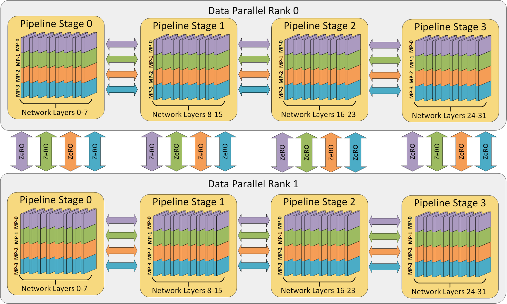

# Distributed Training for Machine Learning

In this blog post we introduce popular concepts and techniques used in distributed training for machine learning.

## Why We Need Distributed Training

Scaling model size has been one of the most successful ways to improve model capabilities for the past 5 years.
However, this comes at the cost of scaling resources.
Recently, large language models require so much memory to run that many don't even fit on a single GPU, let alone training such models.
This situation calls for the need of training models with distributed systems to make training large models possible and faster.

## Collective Operations

Collective operations refer to the ways nodes in a distributed system collaboratively compute a result.
In this blog post, we will be talking about **all-reduce**, **reduce-scatter**, and **all-gather**.
This picture illustrates the operations perfectly:

> [Source](https://engineering.fb.com/2021/07/15/open-source/fsdp/)

## Data Parallel and Pipeline Parallel

Here's the diagram of a typical training step:

```mermaid
flowchart LR
model(["Model Weights"]) --> fwd("Forward Pass")
data([Data]) --> fwd
fwd --> loss(["Loss"])
loss --> bwd("Backward Pass")
bwd --> grad(["Gradients"])
grad --> update("Update Model States")
```

**Data parallel parallelizes data,** assigning each GPU node a different data batch.
GPU nodes synchronize gradients with an all-reduce operation to ensure model states consistency.  
Here's an example of DP (Data Parallelism) = 2:

```mermaid
flowchart LR
  subgraph GPU0
    direction LR
    model0(["Model Weights"]) --> fwd0
    fwd0 --> loss0(["Loss 0"])
    loss0 --> bwd0("Backward Pass")
    bwd0 --> grad0(["Gradients 0"])
    synced_grad0(["Gradients"]) --> update0("Update Model States")
  end

  grad0 --> syncgrad("Sync Grads")
  syncgrad --> synced_grad0
  data([Data]) --> fwd0("Forward Pass")

  subgraph GPU1
    direction LR
    model1(["Model Weights"]) --> fwd1
    fwd1 --> loss1(["Loss 1"])
    loss1 --> bwd1("Backward Pass")
    bwd1 --> grad1(["Gradients 1"])
    synced_grad1(["Gradients"]) --> update1("Update Model States")
  end

  data --> fwd1("Forward Pass")
  grad1 --> syncgrad
  syncgrad --> synced_grad1
```

**Pipeline parallel pipelines model layers,** assigning each GPU node a different set of layers.
Each GPU node serves as a pipeline stage, for example:

> [Source](https://openai.com/research/techniques-for-training-large-neural-networks)

Here's another example of PP (Pipeline Parallelism) = 2:

```mermaid
flowchart LR
  subgraph GPU0
    lyr0_bwd("Layer 0 Backward Pass") --> lyr0_grad(["Layer 0 Gradients"])
    lyr0_grad --> lyr0_update("Update Layer 0 Model States")
  end

  subgraph GPU1
    lyr1_model(["Layer 1 Model Weights"]) --> lyr1_fwd("Layer 1 Forward Pass")
    lyr1_fwd --> loss(["Loss"])
    loss --> lyr1_bwd("Layer 1 Backward Pass")
    lyr1_bwd --> lyr1_grad(["Layer 1 Gradients"])
    lyr1_grad --> lyr1_update("Update Layer 1 Model States")
    lyr1_bwd --> lyr0_bwd
  end

  subgraph GPU0_fwd [GPU 0]
    lyr0_model(["Layer 0 Model Weights"]) --> lyr0_fwd("Layer 0 Forward Pass")
    data([Data]) --> lyr0_fwd
    lyr0_fwd --> lyr1_fwd
  end
```

Comparing pipeline and data parallelism:

| | Data Parallel | Pipeline Parallel |
| :- | :- | :- |
| Split Target | Data | Model |
| Computation Granularity | Unchanged | Reduced |
| Communication Overhead | Increased | Increased More |
| Model States Distribution | Redundant | Replicated |

OpenAI has a nice [blog post](https://openai.com/research/techniques-for-training-large-neural-networks) explaining pipeline parallelism.

## Tensor Parallel

Tensor parallel refers to parallelizing tensor computation across different nodes.
The most notable example is [Megatron-LM](https://arxiv.org/abs/1909.08053).
Megatron-LM partitions MLP layers along the column axis,
so matrix multiplications can be parallelized perfectly without any synchronization during computation.
Every node can get the final result with one all-reduce in the end by leveraging the block matrix property.

For self-attention layers, Megatron-LM parallelizes them along the head dimension.

> [Source](https://arxiv.org/abs/1909.08053)

## 3D Parallelism

3D parallelism employs all 3 types of parallelism (data, pipeline, and tensor), hence 3D.
When using 3D parallelism, users tune the configuration to maximize efficiency based on their compute cluster hardware specifications.  
Here's an illustration of configuration (DP, TP, PP) = (2, 4, 4),
taken from the great [blog post](https://www.microsoft.com/en-us/research/blog/deepspeed-extreme-scale-model-training-for-everyone/)
that explains 3D parallelism in-depth.

> Note on _Model Parallelism_:
> As far as I understand, _model parallelism_ refers to any technique than parallelizes the model.
> Pipeline parallelism is sometimes called model parallelism because it parallelizes the model layers.
> Meanwhile Megatron-LM and the blog post above call what we defined as tensor parallelism
> (parallelizing tensor computation within a model layer) model parallel.
> To avoid confusion, I refrain from using the term _model parallel_ in this blog post.

## ZeRO

## FSDP

## GSPMD

## Further Readings
