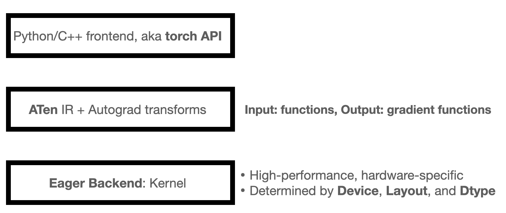
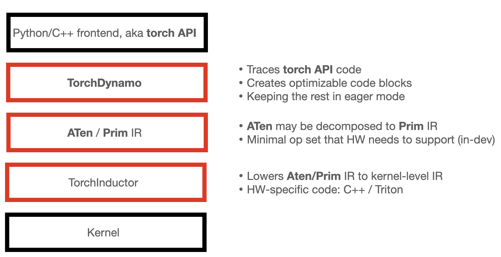

# How PyTorch Works - A Systems Perspective

This is an introduction to how PyTorch works from a systems perspective.  
This post assumes almost no knowledge of machine learning and is written for non-ML engineers.

- [Deep Neural Network Model Development Basics](#Deep-Neural-Network-Model-Development-Basics)
  - [Serving](#Serving)
  - [Training](#Training)
  - [Neural Network Computation](#Neural-Network-Computation)
- [PyTorch](#PyTorch)
  - [The eager-mode lowering pipeline](#The-eager-mode-lowering-pipeline)
  - [The PyTorch 2.0 compiling pipeline](#The-PyTorch-20-compiling-pipeline)

# Deep Neural Network Model Development Basics

The development cycle involves 2 stages: **training** and **serving**.  

## Serving
Serving, aka deployment, is the term for *using* a model: A model receives input data and makes a prediction.
The action of making a prediction is also called **inference**.  
Serving is **mostly a memory-bound workload**, but may be compute-bounded for certain model types,
e.g. convolutional neural networks and large language models.  
The metric that serving cares about is **latency**, i.e. how fast a model generates a response based on a user's input.

## Training
Training is the process of creating a model, which involves 2 steps: inference and optimization.  
The first step is roughly the same as serving: We feed training data into the model for it to make predictions.
Under the training scenario, we also call one inference step a **forward pass**.
However, unlike serving, we always feed data in large batches to speed up training, 
and we store intermmediate values of neural network for the second step.  
In the second step, we update the model parameters based on how wrong the predictions are.
Using the previously stored intermmediate values, we calculate error correction offsets (aka **gradients**) for each parameter.
This process of calculating the offsets is called the **backward pass**, in contrast to the forward pass.
We then apply the offsets to the model parameters according to our choice of optimization algorithm.

Training is a **highly memory-bound workload** because of the backward pass.
Depending on the optimization algorithm, it costs 1x - 3x the memory used by a model's parameters.
Applying parameter updates requires transferring large amounts of data,
and storing/loading intermmediate values is also memory-intensive.
While the amount of intermmediate values depends on the model type,
it usually takes up more memory than both the optimization algorithm and the model parameters.  
The metric that training cares about is **throughput**, i.e. how many samples can be processed per second.

## Neural Network Computation
There are roughly 2 types of computation in a neural network forward and backward pass:
**matrix multiplication** and **point-wise operation**.  
Matrix multiplication is the core computation of neural networks.
It is highly parallelizable and compute-bounded when matrices are large enough.
Point-wise operations refer to operations that perform simple element-wise operations on the whole input matrix,
e.g. activation functions. They are generally memory-bounded.

# PyTorch

## The eager-mode lowering pipeline
Eager mode refers to that PyTorch executes operations line-by-line without a wholistic view of the code.
It has the benefit of flexibility and easier to debug at the cost of many optimization opportunities.  
The current pipeline is as follows:
<!--- This newline is needed to correctly render a numbered list --->

1. Users write code using Python/C++ frontend, i.e. **torch API**.
1. **torch API** gets lowered to **ATen** operator set, which includes an IR and generates autograd transforms.
   - Autograd transforms: The mechanism that takes operations (functions) as input
     and generates the function for calculating the error correction offsets (gradients).
1. **Aten IR** is then used to bootstrap an eager backend, i.e. a kernel.
   - A kernel is determined by the 3 traits of its operands: **device**, **layout**, and **dtype**.

## The PyTorch 2.0 compiling pipeline
1. **TorchDynamo** traces **torch API** code and creates optimizable code blocks, while keeping the rest in eager mode.
1. The code blocks get lowered into **ATen** and may be decomposed into **PrimTorch** IR.
   - **PrimTorch** is a minimal set of operators that a hardware needs to support to cover all operators (In development).
1. **TorchInductor** lowers **ATen/Prim** IR to kernel-level IR and compiles to hardware specific code.

# References

- [PyTorch 2.0 - Overview](https://pytorch.org/get-started/pytorch-2.0/#technology-overview)
- [PyTorch 2 Manifestor and Architecture Docs](https://dev-discuss.pytorch.org/t/pytorch-2-0-manifesto-and-architecture-docs/896)
- [TorchInductor](https://dev-discuss.pytorch.org/t/torchinductor-a-pytorch-native-compiler-with-define-by-run-ir-and-symbolic-shapes/747)
- [PyTorch Internals: ezyang’s blog](blog.ezyang.com/2019/05/pytorch-internals/)
