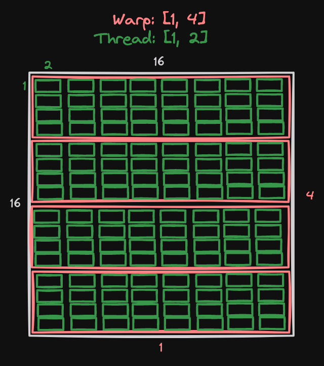
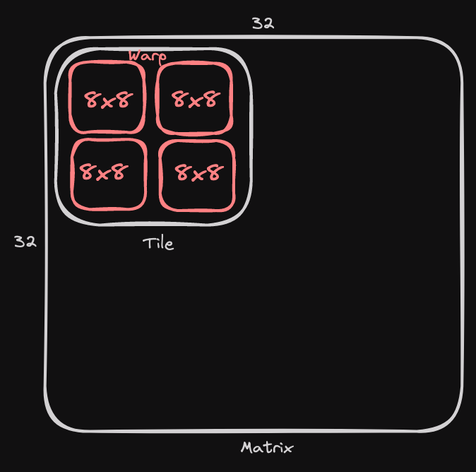
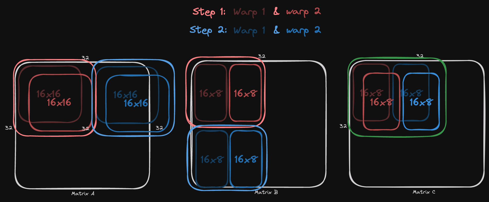

# What Triton Does in A Matix Multiplication

What does Triton do in a matrix multiplication kernel?  
Here we walk through the algorithm for a 32 by 32 square matrix multiplication, from Triton code to PTX.

## Tiled Matrix Multiplication

A tiled matrix multiplication works like a dot product:  
Every element is now a matrix tile, and every multiplication is replaced with a matrix multiplication.  
The output is a matrix of accumulated matmuls.

## Triton

We assign every Triton program to the computation for one 16 by 16 output tile.  
Index calculation is as follows:

| Name | Value |
| :- | :-: |
| Program ID | `(i, j)` |
| Top-left index of the output tile | `(16 * i, 16 * j)` |
| Output tile row indices | `r = 16 * i + range(0, 16)` |
| Output tile column indices | `c = 16 * j + range(0, 16)` |
| Output tile indices | `16 * r[:, None] + c[None, :]` |

We accumulate in FP32 and use Tritons matmul function `tl.dot` to do tile matmul.

## Triton IR

Triton IR looks quite similar to Triton code. It makes tensor data types and tensor broadcasting explicit.  

> Note: Triton IR inherits some [MLIR arith dialect](https://mlir.llvm.org/docs/Dialects/ArithOps/),
> e.g. `splat` converts a scalar to multi-dimensional tensor.

## Triton GPU IR

Triton GPU IR further expands Triton IR, adding memory layout of each tensor.  
Here is blocked encoding `sizePerThread = [1, 2], threadsPerWarp = [4, 8], warpsPerCTA = [4, 1]`:

`nvidia_mma` is the memory layout for tensor core inputs.  
`versionMajor = 2` means we are using the 2nd-gen Tensor Core,
and `instrShape = [16, 8]` means we are using the `mma.m16n8k16` matrix multiply accumulate operation.

`shared` is the memory layout for shared memory, and the configurations indicate the swizzling pattern.

References:

- [Blocked Layout Encoding](https://github.com/triton-lang/triton/blob/384fd6a60ae6a3c158dd569b8ad65fe04ba69293/include/triton/Dialect/TritonGPU/IR/TritonGPUAttrDefs.td#L583)
- [NVIDIA MMA Layout Encoding](https://github.com/triton-lang/triton/blob/384fd6a60ae6a3c158dd569b8ad65fe04ba69293/include/triton/Dialect/TritonGPU/IR/TritonGPUAttrDefs.td#L1045)
- [Shared Layout Encoding](https://github.com/triton-lang/triton/blob/384fd6a60ae6a3c158dd569b8ad65fe04ba69293/include/triton/Dialect/TritonGPU/IR/TritonGPUAttrDefs.td#L152)
  - [Memory Swizzling](https://leimao.github.io/blog/CUDA-Shared-Memory-Swizzling/)
  - [Memory Bank Conflicts](https://leimao.github.io/blog/CUDA-Shared-Memory-Bank/)

## PTX

### Load input tiles from global to shared memory

We first load two 16 by 16 tiles from global memory to shared memory.  
As Triton GPU IR dictates, every thread loads 2 elements per tile.  
We use the non-blocking instruction
[`cp.async.ca.shared.global`](https://docs.nvidia.com/cuda/parallel-thread-execution/index.html?highlight=cp#data-movement-and-conversion-instructions-cp-async)
to copy data from global memory to shared memory.

### Load input tiles from shared memory to registers

We use
[`ldmatrix.sync.aligned.m8n8.x4.shared.b16`](https://docs.nvidia.com/cuda/parallel-thread-execution/index.html?highlight=ldmatrix#warp-level-matrix-instructions-ldmatrix)
to load four 8 by 8 matrices using 1 thread warp, which is exactly one 16 by 16 matrix.  
The second matrix tile is loaded in column-major format: `ldmatrix.sync.aligned.m8n8.x4.trans.shared.b16`.

### Tiled Matrix Multiplication

We use the instruction
[`mma.sync.aligned.m16n8k16.row.col.f32.f16.f16.f32`](https://docs.nvidia.com/cuda/parallel-thread-execution/index.html?highlight=mma#warp-level-matrix-fragment-mma-16816-float).  
It uses tensor cores to perform one `[16, 16] * [16, 8]` matrix multiplication with 1 thread warp.  
We use 2 thread warps to complete the whole `[16, 16] * [16, 16]` matrix multiplication.

